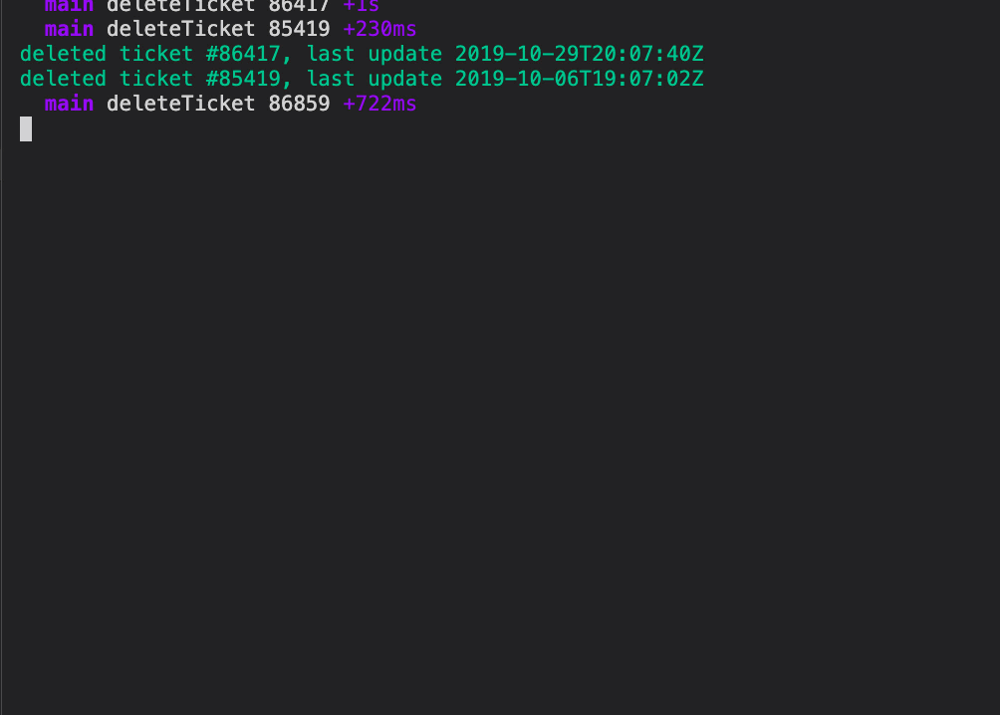

# zendesk ticket deleter

Zendesk seems to archive tickets after 120 days and then they are not visible inside views, but they still can be searched in the system forever (at least as of 2020). You may want to use this tool to delete all tickets they are older than x days from system forever

This library uses node-zendesk (https://github.com/blakmatrix/node-zendesk) library to communicate with API. You will need access to API in order to use this tool.


By default it will delete all tickets they are older than 120 days from now. You may pass `--days <integer>` to define a value greater than 30 (security reasons)




## Installation
```
git clone https://github.com/7c/zendesk-ticket-deleter.git
cd zendesk-ticket-deleter && npm install
```

## Usage
```
## environment variable style
DEBUG=* \
zd_apikey='z3guwt7an64ck7ysqknrfq5bavr3g2hm' \
zd_username='info@test.com' \
zd_apiurl='https://test.zendesk.com/api/v2' \
node zendesk-ticket-deleter.js 
```

or

```
## command line style
DEBUG=* node zendesk-ticket-deleter.js --apikey 'z3guwt7an64ck7ysqknrfq5bavr3g2hm' --username 'info@test.com' --apiurl 'https://test.zendesk.com/api/v2'
```

## Tcp Mutex
to avoid multiple times same operation to be started i have implemenented tcp-mutex package which binds a tcp port to avoid same process to be started several times. You may use optional `--lockport=<port>` parameter to activate

## Rate limiting
Zendesk API does rate limit, that is why i have put 1 second wait after each delete operation.